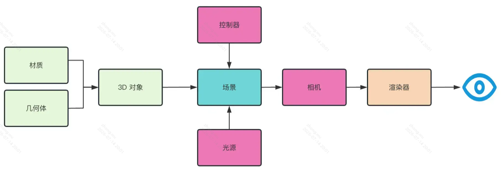

# ThreeJS

**Three 是一个基于 WebGL 的开源 JavaScript 库，用于在 Web 浏览器中创建和渲染三维图形**。它提供了丰富的功能和工具，使开发者能够轻松地构建交互式的 3D 场景、动画和效果。

Three 的功能模块组成可以分为如下：

1.  **场景**（Scene）：用于组织和管理 3D 对象的容器。
2.  **渲染器**（Renderer）：使用 WebGL 技术进行硬件加速的图形渲染。渲染器负责将场景和相机中的内容渲染到绘图上下文中。
3.  **相机**（Camera）：决定了场景中哪些部分可见，并控制了视图的投影方式。
4.  **几何体**（Geometry）：定义了 3D 对象的形状和结构。
5.  **材质**（Material）：决定了 3D 对象的外观和如何对光进行反射。
6.  **光源**（Light）：用于照亮场景中的对象。
7.  **动画**（Animation）：用于创建和控制 3D 对象的动画效果。
8.  **控制器**（Controller）：用于交互式控制和操作 3D 场景。

## 概念

1、投影类型

-   **透视投影**（Perspective Projection）：透视投影模拟了人眼观察远近物体时的透视效果。远处的物体看起来较小，近处的物体看起来较大。简称`近大远小`。
-   **正交投影**（Orthographic Projection）：正交投影保持了物体的透视线都是一个方向，不会因为远近而变化。比如左视图、俯视图等。应用场景例如 CAD 绘图或平面图形的渲染。

2、场景类型

- **OrbitControls（轨道控制器）**用于围绕目标点的交互控制器
- **FlyControls（飞行控制器）**：简单想象成飞机的视角，也就是鼠标的位置会直接修改相机的角度和位置，适用于需要自由探索场景的应用。
- **PointerLockControls（指针锁定控制器）**：允许用户通过鼠标锁定来控制相机，用于第一人称游戏。
- **TrackballControls（轨迹球控制器）**：用户可以通过鼠标左键拖动来旋转相机，通过滚轮来缩放相机，通过鼠标右键拖动来平移相机。
- **DeviceOrientationControls（设备方向控制器）**：允许用户通过设备的陀螺仪或加速度计来控制相机。
- **DragControls（拖拽控制器）**：通过鼠标拖拽来移动场景中的对象。

3、材质类型

- **MeshBasicMaterial**（基础网格材质）：没有光照效果，只显示基本颜色或贴图。
- **MeshLambertMaterial**（兰伯特网格材质）：这种材质对光照非常敏感，可以产生漫反射效果。可以设置基本颜色、贴图、光照颜色等属性。
- **MeshPhongMaterial**（冯氏网格材质）：这种材质对光照更加真实，可以设置基本颜色、贴图、光照颜色、镜面高光颜色、反射率等属性。
- **MeshStandardMaterial**（标准网格材质）：一种基于物理的材质模型，可以产生更真实的光照效果。它结合了漫反射、高光、环境光、法线贴图和粗糙度等属性。
- **MeshPhysicalMaterial**（网格物理材质）：继承自 MeshStandardMaterial，可以实现清漆效果和更真实的玻璃。

4、**刚体**是指一个在物理空间中具有质量、位置和速度的物体，它可以受到力和碰撞的影响，从而改变它的位置和速度。在物理引擎中，刚体通常被用来表示实体对象，如球体、方体等。

5、**碰撞体**是指一个用于**检测碰撞**的几何形状，它可以与其他碰撞体进行碰撞检测，从而确定它们是否相交。在物理引擎中，碰撞体通常与刚体相关联，用于检测刚体之间的碰撞。

## HDR 高动态范围成像

**HDR（High Dynamic Range）是一种图像格式，也称为 HDRI，它用于捕捉和显示更广泛亮度范围的图像**。
HDR 图像可以包含比标准图像格式（如 JPEG）更高的 亮度和颜色信息，以提供更真实和逼真的光照和颜色效果。
HDR 图像使用浮点数格式存储像素值，可以捕捉到非常明亮和非常暗的细节。这使得它们能够更好地模拟真实世界中的光照条件，包括高光和阴影细节。
相比之下，标准图像格式（如 JPEG）通常使用 8 位或 16 位整数格式，无法捕捉到同样广泛的亮度范围。

## PBR 原理

**PBR，或者用更通俗一些的称呼是指基于物理的渲染（Physically Based Rendering），它指的是一些在不同程度上都基于与现实世界的物理原理更相符的基本理论所构成的渲染技术的集合**。